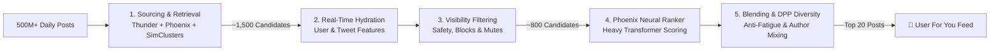

<p align="center">
  <a href="https://x.100xprompt.com" target="_blank" rel="noopener noreferrer">
    
  </a>
  <a href="https://100xprompt.com" target="_blank" rel="noopener noreferrer">
    
  </a>
  
  
  
  
</p>

<h1 align="center">
  ⚡ X-OS Studio - The Open-Source X (Twitter) Algorithm Visualizer & Decompiler
</h1>

<p align="center">
  <b>Reverse-engineer, visualize, and optimize for the world's most powerful recommendation engine.</b><br/>
  An interactive, macOS Sonoma-grade developer studio deconstructing all <b>2,015+ source files</b>, candidate funnels, transformer models, and ranking heuristics of the <b>X "For You" Feed Recommendation Algorithm</b>.
</p>

<p align="center">
  🌐 <b>Explore the Live Studio at <a href="https://x.100xprompt.com">x.100xprompt.com</a></b>
</p>

---

## 🚀 Key Highlights & Interactive Apps

| App / Feature | Description | Key Capabilities |
|---|---|---|
| 🔍 **Algorithm Decompiler** | Interactive multi-pane codebase explorer indexing all 2,015 files | Plain-English architecture translations, syntax-highlighted code viewer, subsystem breakdowns (`thunder`, `phoenix`, `simclusters`, `visibility-filtering`, `user-cred-v2`) |
| 📊 **Interactive Architecture Diagrams** | 4 multi-tab visual system diagrams | • 5-Stage Recommendation Pipeline<br/>• 500M to 20 Candidate Funnel ($<100\text{ms}$)<br/>• Phoenix Two-Tower Transformer Deep Dive<br/>• User Reputation & Safety Filter Pipeline |
| 🧮 **Algorithm Multiplier Matrix** | Live engagement scoring sandbox | Real-time score calculation based on real weights: Copy-Link (+20.0x), Reply-Engaged (+20.0x mutual boost), Video 50% (+1.0x), Report Penalties (-234.0x) |
| 🩺 **Tweet Doctor AI** | Viral tweet analyzer & optimizer | Real-time algorithm compliance scoring, spam penalty detector, 1-click algorithm rewriter, high-CTR template vault |
| 📜 **Architecture Whitepaper** | Complete documentation & creator playbook | The 7 Unbreakable Rules of X Distribution, GraphJet & SimClusters mechanics, and heavy ranker deep-dive |

---

## 🧠 The Physics of the X Feed: 500M to 20 in < 100ms



### 1. Sourcing & Retrieval
- **In-Network (Thunder)**: High-speed in-memory cache indexing recent posts from accounts the user follows.
- **Out-of-Network (Phoenix & SimClusters)**: Matrix factorization and embedding-based two-tower retrieval uncovering relevant content across distinct interest communities.

### 2. Visibility Filtering & Safety Subsystems
- **BotMaker & Scarecrow**: Rule-based heuristic detectors filtering spam and bot behavior.
- **Agatha, BDSM & User-Cred-v2**: Account-level reputation and quality scoring models.
- **Media-Model-Proxy & CLIP**: Multi-modal vision analysis for safety and media comprehension.

### 3. Neural Scoring & The Ranking Formula
Candidate posts are scored using predicted engagement probabilities weighted by the open-source weights:

$$\text{Score} = \sum (w_i \cdot P(\text{Action}_i)) - \sum (\lambda_j \cdot P(\text{Negative}_j))$$

- **Bookmark / Copy Link**: $+20.0$ boost
- **Mutual Conversation / Engaged Reply**: $+20.0$ boost
- **Reply with Author Engagement**: $+5.0$ boost
- **Retweet / Repost**: $+1.0$ boost
- **Like / Favorite**: $+0.5$ boost
- **Video Retention (>50%)**: $+1.0$ boost
- **User Block / Mute / Report**: $-74.0$ to $-234.0$ penalty

---

## 🛠️ Tech Stack & Architecture

- **Framework**: [Next.js 15](https://nextjs.org/) (App Router, Server & Client Components)
- **Language**: TypeScript 5.7
- **Styling**: Tailwind CSS 3.4 + Custom Deep Obsidian Acrylic Glass (`#0b0e17`) & Aluminum Light Theme
- **Animations**: Framer Motion 12
- **Icons**: Lucide React
- **Hosting / Deployment**: Production-grade edge container at [x.100xprompt.com](https://x.100xprompt.com)

---

## 🏃 Getting Started Locally

### Prerequisites
- Node.js 20+ or [Bun](https://bun.sh) (Recommended)
- Git

### Installation

```bash
# 1. Clone the repository
git clone https://github.com/Nipurn123/x-os-studio.git
cd x-os-studio

# 2. Install dependencies
bun install
# or npm install / pnpm install

# 3. Start the development server
bun run dev
# or npm run dev
```

Open [http://localhost:3000](http://localhost:3000) with your browser to experience X-OS Studio locally.

### Production Build

```bash
# Build the optimized production bundle
bun run build

# Start the production server
bun run start
```

---

## 📁 Repository Structure

```
.
├── src/
│   ├── app/               # App Router & API Endpoints
│   ├── components/        # Modern macOS Studio UI & Diagram Components
│   │   ├── apps/          # Tweet Doctor, Matrix Simulator, Finder & Decompiler Apps
│   │   ├── macos/         # Dock, TopBar, Window Frames & Acrylic Theme
│   │   └── diagrams/      # SVG/Mermaid Architecture Diagrams
│   └── lib/               # 2,015 Indexed Repo Slices & Parser Data
├── public/                # Vector Brand Assets & SVG Logos
├── package.json           # Package definitions & scripts
└── README.md              # Architectural Documentation & Quickstart
```

---

## 🌟 The 7 Unbreakable Rules of X Distribution

1. **Maximize High-Dwell Actions**: Direct link-copies, bookmarks, and video completions carry up to **40x more ranking weight** than passive likes.
2. **Ignite Reciprocal Conversations**: Author replies within a thread unlock the $+20.0$ mutual conversation multiplier.
3. **Guard Your Account Reputation**: A low `user-cred-v2` score drops candidate selection during early-stage retrieval before Phoenix even ranks your post.
4. **Avoid Outbound Link Traps**: Posts with raw outbound links receive a heavy downranking penalty in out-of-network candidate retrieval.
5. **Optimize Media Retention**: Upload native video and high-contrast media parsed by `media-model-proxy`.
6. **Prevent Report Velocity**: High report/block velocity triggers immediate Visibility Filtering and account-wide dampening.
7. **Maintain Topic Coherence**: Leverage `SimClusters` by posting consistently within known high-reputation cluster spaces.

---

## 🤝 Contributing

Contributions, issues, and feature requests are welcome! Feel free to check out the [issues page](https://github.com/Nipurn123/x-os-studio/issues).

1. Fork the Project
2. Create your Feature Branch (`git checkout -b feature/AmazingFeature`)
3. Commit your Changes (`git commit -m 'Add some AmazingFeature'`)
4. Push to the Branch (`git push origin feature/AmazingFeature`)
5. Open a Pull Request

---

## 📜 License & Acknowledgments

This visualizer and exploration studio is built and maintained by [100xprompt](https://100xprompt.com) and licensed under the **Apache-2.0 License**. See [LICENSE](LICENSE) for details.
The underlying reference algorithm code is licensed under Apache-2.0 / AGPL by X.AI / X Corp.

<p align="center">
  Built with ❤️ by the <a href="https://100xprompt.com">100xprompt</a> team. Live at <a href="https://x.100xprompt.com"><b>x.100xprompt.com</b></a>
</p>
